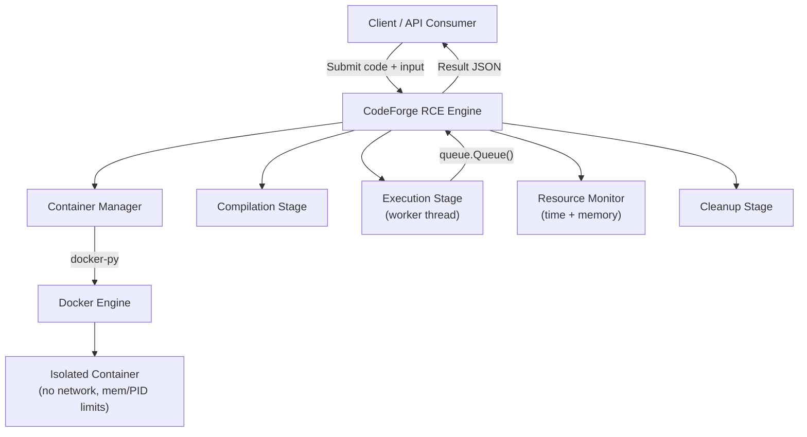
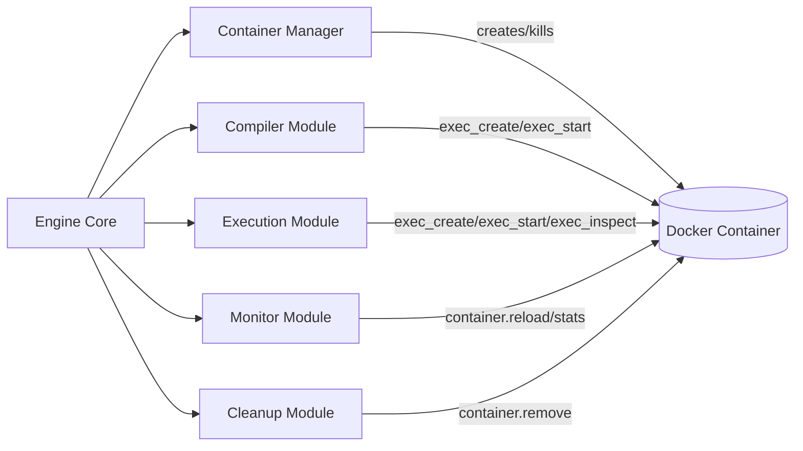
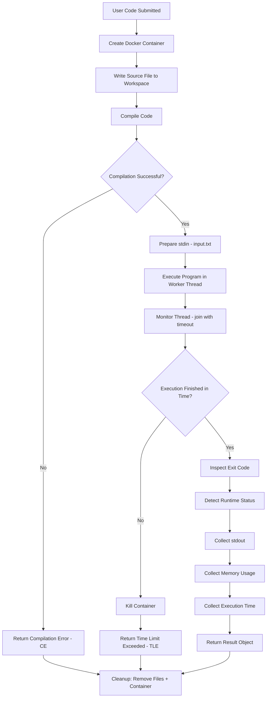

<div align="center">

# ⚙️ CodeForge RCE

### A Secure, Docker-Based Remote Code Execution Engine

*Compile. Execute. Isolate. Repeat.*

[](https://www.python.org/)
[](https://www.docker.com/)
[](#roadmap)
[](#supported-languages)
[](#contributing)

</div>

---

## 📖 Table of Contents

- [Overview](#-overview)
- [Why CodeForge RCE?](#-why-codeforge-rce)
- [Tech Stack](#-tech-stack)
- [Architecture](#-architecture)
- [Execution Workflow](#-execution-workflow)
- [How It Works](#-how-it-works)
  - [1. Container Creation](#1-container-creation)
  - [2. Workspace Layout](#2-workspace-layout)
  - [3. Compilation](#3-compilation)
  - [4. Stdin Handling](#4-stdin-handling)
  - [5. Program Execution](#5-program-execution)
  - [6. Time Limit Enforcement](#6-time-limit-enforcement)
  - [7. Memory Limit Enforcement](#7-memory-limit-enforcement)
  - [8. Runtime Error Detection](#8-runtime-error-detection)
  - [9. Output Collection](#9-output-collection)
  - [10. Execution Metrics](#10-execution-metrics)
  - [11. Resource Cleanup](#11-resource-cleanup)
- [Result Object](#-result-object)
- [Supported Features](#-supported-features)
- [Project Structure](#-project-structure)
- [Design Decisions](#-design-decisions)
- [Limitations](#-current-limitations)
- [Roadmap](#-roadmap)
- [Contributing](#-contributing)

---

## 🧭 Overview

**CodeForge RCE** (Remote Code Execution Engine) is a Docker-based backend engine written in Python for **securely compiling and executing untrusted, user-submitted source code** inside fully isolated containers.

It is not a coding platform itself — it is the **execution core** meant to power one. Any product that needs to safely run arbitrary code submitted by unknown users can plug this engine in as its execution backend.

Typical consumers of this engine include:

| Use Case | Description |
|---|---|
| 🏆 Online Judges | Automated grading of competitive programming submissions |
| 💼 Coding Interview Platforms | Live candidate code execution in a sandbox |
| 🤖 AI Coding Assistants | Safe execution of AI-generated code snippets |
| 🎓 Educational Platforms | Running student code in classroom/exercise environments |
| 🖥️ Browser-Based Code Editors | Backend execution service for in-browser IDEs |
| 🧪 General Sandboxed Execution | Any system that must never trust the code it runs |

> **Note:** CodeForge RCE's core objective is not simply "running code" — it is building a **reusable, resilient execution engine** that correctly handles compiler failures, runtime crashes, resource exhaustion, and container lifecycle management, all while remaining language-agnostic in design.

---

## 🎯 Why CodeForge RCE?

Running arbitrary, untrusted code is inherently dangerous. A naive `subprocess.run()` call on user code can:

- Fork-bomb the host machine
- Read/write files outside its intended scope
- Open network sockets to exfiltrate data or attack other systems
- Consume unbounded CPU, memory, or disk
- Hang indefinitely

CodeForge RCE addresses all of this by executing **every single submission inside its own disposable, network-isolated, resource-capped Docker container** — treating each execution as fully untrusted, every time.

---

## 🧱 Tech Stack

**Core**

- **Python** — orchestration, threading, Docker SDK integration
- **Docker SDK for Python** (`docker-py`) — container lifecycle & low-level exec API
- **Docker Engine** — isolation, cgroups, namespaces

**Currently Supported Language**

- ✅ C++ (via `g++`)

**Planned Language Support**

- Python
- Java
- C
- Go
- Rust
- JavaScript

---

## 🏗️ Architecture

### High-Level Architecture



### Component Interaction



---

## 🔄 Execution Workflow

The full lifecycle of a single submission, from arrival to final result:



> **Note:** Every path through this flowchart — success, compile error, or timeout — always terminates in the **Cleanup** stage. No container or temporary file is ever left behind.

---

## 🔍 How It Works

### 1. Container Creation

Every submission gets a **brand-new, disposable Docker container**. Containers are never reused across submissions, which guarantees that no state (files, memory, processes) can leak between users.

Each container is created with:

- 🔒 An isolated filesystem
- 🚫 Networking disabled (`network_disabled=True` / `network_mode="none"`)
- 📉 A hard memory limit (`mem_limit`)
- 🧵 A PID limit (`pids_limit`) to prevent fork bombs
- 📁 A mounted host workspace directory

The container is started with a long-lived no-op command:

```bash
sleep infinity
```

This keeps the container alive and idle so the engine can `exec` compilation and execution commands into it on demand, without paying the cost of container startup twice.

### 2. Workspace Layout

The host machine's workspace directory for a submission is bind-mounted into the container at:

```
/app
```

A typical workspace contains:

```
workspace/
├── code.cpp     # Source file written by the engine
├── out          # Compiled binary (produced by g++)
└── input.txt    # stdin payload for the program
```

All files in this workspace are **temporary** and are deleted automatically once execution completes (see [Resource Cleanup](#11-resource-cleanup)).

### 3. Compilation

Compilation is a distinct phase that happens **before** any execution is attempted.

The engine invokes `g++` inside the running container via Docker's exec API:

```bash
g++ /app/code.cpp -o /app/out
```

- If compilation fails, the compiler's `stderr` is captured verbatim and returned to the caller as a **Compilation Error (CE)**.
- If compilation fails, **execution never begins** — there is no point spending CPU/memory budget on a program that doesn't exist.

### 4. Stdin Handling

Rather than piping stdin directly into a Docker exec socket (which is fiddly and stream-management-heavy), CodeForge RCE takes a much simpler approach: it writes the input to a file.

```
/app/input.txt
```

The compiled program is then invoked with shell redirection:

```bash
/app/out < /app/input.txt
```

**Why this approach?**

| Benefit | Explanation |
|---|---|
| Simple | No socket stream juggling, no partial-write edge cases |
| Reliable | File I/O is far less error-prone than live socket attachment |
| Language-independent | Works identically for C++, Python, Java, etc. — redirection is a shell-level concept |
| Judge-like | Mirrors exactly how traditional online judges feed input to submissions |

Even when a submission provides no input, an **empty `input.txt`** is still created so the redirection command is always valid.

### 5. Program Execution

Execution uses Docker's **low-level exec API** directly rather than higher-level convenience wrappers, giving the engine full control over the process lifecycle:

```python
exec_id = client.exec_create(container.id, cmd, stdin=False)
client.exec_start(exec_id)
inspect = client.exec_inspect(exec_id)
```

- `exec_create()` — registers the command to run inside the already-running container
- `exec_start()` — actually runs it, and **blocks the calling thread** until the process completes
- `exec_inspect()` — retrieves the exit code and status once execution finishes

Because `exec_start()` is a **blocking call**, calling it directly on the main thread would freeze the entire engine for the duration of the user's program — including programs stuck in an infinite loop. To avoid this, execution is dispatched into a **dedicated worker thread**.

The worker thread communicates its result back to the main thread using a thread-safe `queue.Queue()`:

```python
result_queue = queue.Queue()

def run_in_container():
    output = exec_start(...)
    result_queue.put(output)

worker = threading.Thread(target=run_in_container)
worker.start()
```

`queue.Queue()` is used specifically because it is **thread-safe by design** — it internally handles the locking needed so the main thread can safely retrieve a result that was produced on a different thread, without any risk of race conditions.

### 6. Time Limit Enforcement

The main thread enforces the time limit by joining the worker thread with a timeout:

```python
worker.start()
worker.join(timeout=TIME_LIMIT_SECONDS)

if worker.is_alive():
    container.kill()
    return {"status": "TLE"}
```

If the worker thread is still alive after the timeout elapses, the program did not finish in time. The main thread forcefully **kills the container**, which immediately terminates every process running inside it — including any infinite loop, deadlock, or runaway computation — and reports a **Time Limit Exceeded (TLE)** result.

> **Why kill the container instead of just killing the process?** Killing the container guarantees a clean, complete termination of *everything* running inside it — child processes, forked processes, hung threads — with a single, unambiguous operation.

### 7. Memory Limit Enforcement

Memory limits are enforced at the **container level**, configured at creation time (`mem_limit`), so the Linux kernel's cgroup controller enforces the cap directly — no busy-polling required during execution.

After execution finishes, the engine calls:

```python
container.reload()
state = container.attrs["State"]
```

and inspects the `OOMKilled` flag. If `OOMKilled` is `True`, the kernel killed the process for exceeding its memory cap, and the engine reports **Memory Limit Exceeded (MLE)**.

### 8. Runtime Error Detection

Once execution completes normally, the process's exit code is mapped to a human-readable status:

| Exit Code | Meaning |
|:---:|---|
| `0` | ✅ SUCCESS |
| `132` | Illegal Instruction (`SIGILL`) |
| `134` | Abort (`SIGABRT`) |
| `136` | Floating Point Exception (`SIGFPE`) |
| `137` | Killed (`SIGKILL` — often OOM) |
| `139` | Segmentation Fault (`SIGSEGV`) |
| *other* | Generic Runtime Error |

This mapping lets the engine translate raw POSIX exit/signal codes into clear, actionable statuses for the calling application without exposing low-level Unix signal semantics to the end user.

### 9. Output Collection

`stdout` produced by the program during `exec_start()` is captured and returned as-is.

If the program terminates abnormally (e.g., a crash) and produces **no output at all**, the engine substitutes a default, human-readable message instead of returning an empty string — so consumers of the API never have to guess whether "empty" means "no output" or "something went wrong upstream."

### 10. Execution Metrics

**Execution Time**

Measured by wrapping the execution call with `time.perf_counter()`:

```python
start = time.perf_counter()
# ... run program ...
end = time.perf_counter()
execution_time_ms = (end - start) * 1000
```

`perf_counter()` is used because it provides the highest-resolution monotonic clock available, unaffected by system clock adjustments — ideal for measuring short-duration execution windows.

**Memory Usage**

Collected from Docker's container stats API and converted from bytes into megabytes for readability:

```python
stats = container.stats(stream=False)
memory_mb = stats["memory_stats"]["max_usage"] / (1024 * 1024)
```

### 11. Resource Cleanup

Regardless of whether execution succeeded, crashed, or timed out, the engine always performs cleanup as the final step:

- 🗑️ Delete `input.txt` (and other temporary workspace files)
- 🗑️ Remove the Docker container (`container.remove(force=True)`)

This guarantees that **no temporary resources — files or containers — are ever left behind**, keeping the host environment clean across thousands of submissions.

---

## 📦 Result Object

Every submission produces a single, consistent JSON result object:

```json
{
    "status": "SUCCESS",
    "stdout": "Hello World",
    "status_code": 0,
    "execution_time_ms": 3.14,
    "memory_mb": 8.27
}
```

| Field | Type | Description |
|---|---|---|
| `status` | `string` | High-level outcome: `SUCCESS`, `CE`, `RE`, `TLE`, `MLE`, etc. |
| `stdout` | `string` | Captured standard output from the executed program |
| `status_code` | `integer` | Raw process exit code (mapped per the [runtime error table](#8-runtime-error-detection)) |
| `execution_time_ms` | `float` | Wall-clock execution duration in milliseconds |
| `memory_mb` | `float` | Peak memory usage in megabytes |

> **Warning:** On compilation failure, `stdout` is replaced with the compiler's `stderr` output and `status` is set to `"CE"`. No `execution_time_ms` or `memory_mb` is meaningful in this case, since the program never ran.

---

## ✅ Supported Features

| Feature | Status |
|---|:---:|
| Docker-based isolation | ✔️ |
| Secure, per-submission execution | ✔️ |
| C++ compilation | ✔️ |
| stdin support | ✔️ |
| stdout capture | ✔️ |
| Compilation error detection | ✔️ |
| Runtime error detection | ✔️ |
| Segmentation fault detection | ✔️ |
| Floating point exception detection | ✔️ |
| Illegal instruction detection | ✔️ |
| Abort detection | ✔️ |
| Timeout (TLE) detection | ✔️ |
| Memory limit (MLE) detection | ✔️ |
| Execution time measurement | ✔️ |
| Memory usage measurement | ✔️ |
| Automatic resource cleanup | ✔️ |

---

## 🗂️ Project Structure

```
codeforge-rce/
├── engine/
│   ├── __init__.py
│   ├── container_manager.py     # Container lifecycle: create, kill, remove
│   ├── compiler.py              # Compilation stage (g++ invocation)
│   ├── executor.py              # exec_create / exec_start / worker thread logic
│   ├── monitor.py               # Timeout + memory monitoring
│   ├── result_mapper.py         # Exit-code → status mapping
│   └── cleanup.py               # File + container cleanup
├── workspace/                   # Per-submission mounted directories (runtime-generated)
├── config/
│   └── limits.py                # Timeout, memory, PID limit configuration
├── tests/
│   ├── test_compilation.py
│   ├── test_execution.py
│   └── test_limits.py
├── examples/
│   └── sample_submission.py
├── requirements.txt
└── README.md
```

---

## 🧠 Design Decisions

A summary of the reasoning behind CodeForge RCE's key architectural choices.

**Why Docker?**
Docker provides battle-tested process isolation via Linux namespaces and cgroups, giving strong filesystem, network, and resource boundaries without the operational overhead of full virtual machines.

**Why `exec_create()` / `exec_start()` instead of `container.run()`?**
Using the low-level exec API against a long-lived container avoids the repeated overhead of spinning up a fresh container for *both* compilation and execution — the container is created once, and multiple commands are exec'd into it sequentially.

**Why a worker thread for execution?**
`exec_start()` is a blocking call. Running it directly on the main thread would freeze the entire engine while waiting on potentially malicious or hung user code. Offloading it to a worker thread lets the main thread retain control and enforce a timeout independently.

**Why `queue.Queue()` for thread communication?**
It's the standard, thread-safe primitive in Python's standard library for passing data between threads without manually managing locks — reducing the surface area for race conditions.

**Why a mounted workspace instead of copying files into the container?**
Bind-mounting a host directory is faster than copying files in and out of a container image layer, and it makes writing/reading files (`code.cpp`, `out`, `input.txt`) trivial from both the host and container side.

**Why `input.txt` instead of attaching to Docker's stdin socket?**
Docker's raw stdin socket attachment requires careful stream framing and can be fragile across different exec sessions. Writing input to a file and using shell redirection (`< input.txt`) is simpler, more reliable, and completely language-agnostic.

**Why kill the container instead of just killing the process (on TLE)?**
Killing the container is a single atomic operation that guarantees termination of the target process *and* any children/forks it spawned — closing off potential fork-bomb or zombie-process edge cases that killing a single PID would not.

**Why one container per submission?**
Per-submission containers guarantee **zero state leakage** between users. No submission can ever see another submission's files, environment variables, memory, or leftover processes.

---

## ⚠️ Current Limitations

> **Note:** CodeForge RCE is under active development. The following are known limitations of the current version:

- Only **C++** is currently supported
- Executes **one submission at a time** (no built-in concurrency/queueing layer yet)
- No multi-language compiler manager abstraction yet
- Workspace directory structure is currently shared rather than fully isolated per submission
- Memory monitoring is basic (peak usage only, no time-series sampling)

---

## 🛣️ Roadmap

- [ ] Multi-language support (Python, Java, C, Go, Rust, JavaScript)
- [ ] Separate `stdout` / `stderr` streams
- [ ] CPU usage limits (in addition to memory/PID limits)
- [ ] Read-only root filesystem inside containers
- [ ] Non-root user execution inside containers
- [ ] Linux capability dropping (`cap_drop: ALL`)
- [ ] Fully isolated per-submission workspace directories
- [ ] Dedicated judge module (expected vs. actual output comparison)
- [ ] Multiple test case support per submission
- [ ] REST API layer
- [ ] Web-based submission UI
- [ ] Distributed / horizontally-scaled execution across worker nodes

---

## 🤝 Contributing

Contributions, issues, and feature requests are welcome! Feel free to check the [issues page](#) or open a pull request.

1. Fork the project
2. Create your feature branch (`git checkout -b feature/amazing-feature`)
3. Commit your changes (`git commit -m 'Add some amazing feature'`)
4. Push to the branch (`git push origin feature/amazing-feature`)
5. Open a Pull Request

---


**CodeForge RCE** — Built for developers who need to run untrusted code without trusting it.

</div>