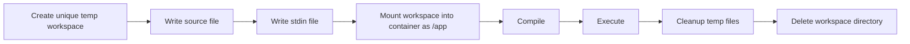
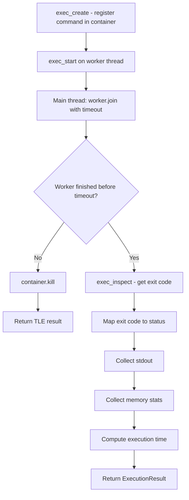

# CodeForge RCE

**A Docker-based, isolated Remote Code Execution (RCE) engine, distributed as a reusable Python package.**

---

## Table of Contents

- [What This Project Is](#what-this-project-is)
- [Project History / Evolution](#project-history--evolution)
- [Current Architecture](#current-architecture)
- [1. Models](#1-models)
- [2. Workspace Manager](#2-workspace-manager)
- [3. Docker Environment](#3-docker-environment)
- [4. Container Manager](#4-container-manager)
- [5. Compiler](#5-compiler)
- [6. Executor](#6-executor)
- [7. Language Abstraction](#7-language-abstraction)
- [8. CodeForgeRCE Class](#8-codeforgerce-class)
- [9. Error Handling](#9-error-handling)
- [10. Cleanup and Resource Lifecycle](#10-cleanup-and-resource-lifecycle)
- [11. Concurrency](#11-concurrency)
- [12. Docker Image Distribution](#12-docker-image-distribution)
- [13. Python Package Architecture](#13-python-package-architecture)
- [14. Distribution / Release Workflow](#14-distribution--release-workflow)
- [15. Project Structure](#15-project-structure)
- [16. Testing](#16-testing)
- [17. Real-World Usage](#17-real-world-usage)
- [18. Security / Isolation Discussion](#18-security--isolation-discussion)
- [19. Limitations](#19-limitations)
- [20. Future Roadmap](#20-future-roadmap)

---

## What This Project Is

CodeForge RCE is **not primarily an online coding judge**. It is a reusable code execution engine, distributed as a Python package, whose responsibility is limited to:

1. Accept source code and an execution configuration.
2. Prepare an isolated execution environment.
3. Compile the code when compilation is required.
4. Execute the compiled (or interpreted) program inside Docker.
5. Provide stdin to the running program when supplied.
6. Capture stdout/stderr.
7. Enforce execution time and memory limits.
8. Detect common runtime failure modes.
9. Measure execution time and memory usage.
10. Clean up all temporary resources.
11. Support a configurable, language-agnostic execution architecture.
12. Function as a reusable Python library that other applications import and call directly — it is not itself a web service, judge platform, or UI.

Anything resembling an "online judge" (test case comparison, submission history, ranking, problem statements) is **out of scope** for this engine. Those concerns belong in an application built *on top of* CodeForge RCE, not inside it.

**Current language support: C++ only.** The architecture is deliberately built so additional languages can be registered later without modifying the compiler or executor internals, but no other language is implemented today. Any mention of Python, Java, Go, or Rust support elsewhere in this document is explicitly marked as a **FUTURE** architectural example, not a current capability.

---

## Project History / Evolution

The project did not start as a layered package — it started as a single procedural script.

**First implementation (procedural):**

- Connected to Docker using the Docker Python SDK (`docker.from_env()`).
- Created a container from a fixed `codeforge-rce` image.
- Mounted a host workspace directory into `/app` inside the container.
- Compiled `/app/code.cpp` using `g++`.
- Executed the resulting `/app/out` binary.
- Supported optional stdin by writing it to `/app/input.txt`.
- Enforced a timeout using a worker thread joined with a timeout value.
- Detected memory exhaustion by inspecting Docker's `OOMKilled` container state.
- Detected runtime errors by inspecting process exit codes.
- Measured execution time and memory usage.
- Removed temporary files and the container after execution finished.

This version worked, but everything — Docker connection handling, container configuration, compilation, execution, timeout logic, cleanup — lived in one script. That was acceptable for a single proof of concept, but it did not scale as a reusable component.

**Refactor into layers.** The single script was progressively broken apart into distinct classes and modules, each owning one responsibility. This is the architecture described in the rest of this document.

---

## Current Architecture

### Why layered instead of one file

Keeping everything in a single script creates several concrete problems once the project needs to be reused as a library:

- **Testability** — a monolithic script that creates real Docker containers on import is nearly impossible to unit test in isolation. Separating Docker connection setup, container lifecycle, compilation, and execution allows each to be tested (or mocked) independently.
- **Reusability** — other projects should be able to `import` a compiler or an executor without pulling in unrelated concerns like CLI argument parsing or hardcoded paths.
- **Extensibility** — adding a second language should not require touching container logic, and changing the container resource limits should not require touching compilation logic. When responsibilities are mixed, every change risks breaking something unrelated.
- **Debuggability** — when a failure occurs, a layered design tells you which layer is responsible: a `DOCKER_UNAVAILABLE` error clearly comes from `DockerEnvironment`; a `TLE` clearly comes from `Executor`. In a single script, all failures look the same.
- **Reasoning about state** — Docker containers, temporary files, and thread state are all separate lifecycles. Keeping them in separate objects makes each lifecycle explicit instead of implicit shared mutable state in one function.

### Logical layers

```
ExecutionRequest
      │
      ▼
CodeForgeRCE (orchestration)
      │
      ├──▶ LanguageRegistry / LanguageConfig
      ├──▶ WorkspaceManager
      ├──▶ DockerEnvironment
      ├──▶ ContainerManager
      ├──▶ Compiler
      └──▶ Executor
                │
                ▼
        ExecutionResult
```

| Layer | Responsibility |
|---|---|
| Models | Define data contracts (`ExecutionRequest`, `ExecutionResult`, `CompileResult`) passed between layers |
| WorkspaceManager | Create/destroy a unique temporary directory per execution |
| DockerEnvironment | Own the Docker connection, image availability, pulling/building |
| ContainerManager | Create, configure, start, kill, and remove containers |
| Compiler | Run the compile step inside a container and produce a `CompileResult` |
| Executor | Run the compiled/interpreted program, enforce limits, collect results |
| LanguageRegistry / LanguageConfig | Map a language identifier to its compile/run commands |
| CodeForgeRCE | Public orchestration layer / the object consumers actually interact with |
| Python package layer | Packaging, distribution, imports (`pip install`) |
| Docker runtime image | The actual container image containing compilers/interpreters |

Each layer is described in depth below.

---

## 1. Models

Three data models define the contracts between layers: `ExecutionRequest`, `ExecutionResult`, and `CompileResult`.

### `ExecutionRequest`

Represents a single execution job. Conceptually it carries:

- `code` — the source code to execute
- `language` — a language identifier (e.g. `"cpp"`), resolved against the `LanguageRegistry`
- `stdin` — optional input to feed the program
- `timeout` — the time limit, in seconds, for the execution phase

`ExecutionRequest` is deliberately **pure data** — it contains no methods that talk to Docker, no file I/O, and no execution logic. It exists to describe *what* should be run, not *how* it is run.

This separation matters for a library/API surface:

- **Request data** (`ExecutionRequest`) describes intent and is safe to construct, validate, serialize, and pass around without side effects — useful if a consuming application wants to queue requests, log them, or validate them before dispatching to the engine.
- **Execution engine behavior** (`CodeForgeRCE`, `Executor`, `ContainerManager`, etc.) is where the actual work — spawning containers, running processes — happens.
- **Execution result** (`ExecutionResult`) is the outcome, again pure data, safe to serialize back to a caller (e.g. as JSON in an HTTP response) without leaking engine internals.

If request, behavior, and result were merged into one object, a consumer serializing a request to a queue could accidentally serialize live Docker handles or thread objects. Keeping them separate keeps the public API of the library clean and makes each object trivially serializable where it needs to be.

### `ExecutionResult`

Represents the outcome of running a program. Conceptually it carries:

- `status` — the outcome category (e.g. `SUCCESS`, `TLE`, `SEGMENTATION_FAULT`; see [Error Handling](#9-error-handling))
- `stdout` — captured standard output
- `status_code` — the underlying process exit code
- `execution_time_ms` — wall-clock execution duration
- `memory_mb` — peak memory usage during execution

### `CompileResult`

Represents the outcome of the compilation phase, when compilation applies. Conceptually it carries:

- `status` — whether compilation succeeded or failed
- `logs` — compiler output (stdout/stderr from the compiler, e.g. `g++` diagnostics)
- `status_code` — the compiler process's exit code

`CompileResult` is intentionally a separate model from `ExecutionResult` because compilation and execution are separate phases with separate failure modes — a compilation failure should never be reported using execution-phase fields like `execution_time_ms`, since the program never ran.

Together, these three models form the clean contract boundary between layers: `WorkspaceManager`, `ContainerManager`, `Compiler`, and `Executor` all communicate using these models rather than passing around raw dictionaries or Docker SDK objects, which keeps the internal Docker/SDK details from leaking into consumer-facing code.

---

## 2. Workspace Manager

### The problem with a shared workspace

An early, simpler design might use a single fixed path such as `workspace/code.cpp` for every execution. This is unsafe the moment more than one execution can happen close together in time:

```
Request A writes workspace/code.cpp
Request B writes workspace/code.cpp   <-- overwrites A's source before A compiles/runs
Request A compiles/executes B's code
```

Even without true multi-threaded concurrency, any overlap between "write source" and "compile/execute" for two different requests using the same path creates a race condition that silently produces wrong results — potentially executing one user's code under another user's request.

### The current design: per-execution temporary workspace

Instead of one static workspace, `WorkspaceManager` creates a **unique temporary directory per execution context**. Each request gets its own isolated directory on the host filesystem, so no two in-flight executions can ever share a path.

Workspace lifecycle:



Responsibilities of `WorkspaceManager`:

- **Create** a unique temporary directory (e.g. using the standard library's temp-directory facilities so uniqueness is guaranteed by the OS/stdlib, not by hand-rolled naming).
- **Write** the source file into that directory using the filename dictated by the resolved `LanguageConfig` (e.g. `code.cpp`).
- **Write** the stdin payload into that directory as a file (consumed later by the Executor).
- **Expose** the directory path so `ContainerManager` can bind-mount it into the container at `/app`.
- **Delete** the entire directory (and everything in it) once execution is complete, regardless of whether execution succeeded, failed, or errored.

### Why the workspace must not live inside the installed package directory

CodeForge RCE is installed like any other Python package, typically into a `site-packages` directory. Writing runtime, per-execution data (source files, compiled binaries, stdin files) into the installed package directory would be problematic for several reasons:

- Package installation directories are not guaranteed to be writable by the running process (especially in system-wide installs).
- Mixing runtime-generated data with installed package code makes upgrades and reinstalls fragile — stale runtime files could be left behind or accidentally overwritten.
- It conflates two different lifecycles: the package's own code (installed once) versus per-execution ephemeral data (created and destroyed constantly).

Instead, workspaces are created in the OS-designated temporary directory space, entirely separate from wherever the package itself is installed. This also makes the package reusable across multiple host projects without those projects needing to grant write access to their own `site-packages`.

---

## 3. Docker Environment

`DockerEnvironment` owns everything related to *whether and how* Docker is available and *which image* will be used — before any container is ever created.

Responsibilities:

- Connect to the Docker daemon.
- Check whether Docker is actually available/reachable.
- Check whether the configured runtime image already exists locally.
- Pull the image from Docker Hub if it does not exist locally and auto-pull is enabled.
- Optionally build a local image from a Dockerfile/build context, if configured to do so.
- Prepare the Docker environment before any execution begins.

### Lazy Docker connection

Instantiating the public API object does **not** require Docker to be running:

```python
rce = CodeForgeRCE()   # does not require Docker to be up
```

The actual check for Docker availability happens later, when execution is actually requested (`rce.execute(request)`), not at construction time. This matters because:

- A consuming application may want to construct `CodeForgeRCE()` early (e.g. at process startup) without failing hard if Docker isn't ready yet.
- It allows the engine to fail gracefully, per-request, with a clean result object instead of raising an exception during unrelated startup code.

### The four Docker/image scenarios

| Scenario | Behavior |
|---|---|
| A. Docker unavailable | Execution returns a clean `DOCKER_UNAVAILABLE`-style result instead of raising an unhandled exception. |
| B. Docker available, image exists locally | The image is used immediately — no network access needed. |
| C. Docker available, image missing locally | If auto-pull is enabled, the configured image is pulled from Docker Hub automatically before execution proceeds. |
| D. Custom/local image build (optional) | If configured with a build context, a local image is built from a Dockerfile instead of pulling a prebuilt image. |

### Why pulling and building are separate concepts

Pulling and building solve different problems and have different trust models:

- **Pulling** retrieves a prebuilt, already-published image (from Docker Hub) — fast, and appropriate for the default out-of-the-box experience (`pip install codeforge-rce` and go).
- **Building** constructs a fresh image from a Dockerfile/build context supplied by the consuming project — appropriate when a user needs a customized runtime (extra libraries, a different compiler version, additional languages baked into the image) that the default published image doesn't provide.

Keeping these as separate, explicit code paths avoids accidentally rebuilding an image on every run (expensive) and avoids accidentally pulling over a deliberately customized local image (which would silently discard a user's customizations).

---

## 4. Container Manager

`ContainerManager` is responsible for the mechanical lifecycle of Docker containers, and nothing else.

Responsibilities:

- Create containers from the resolved image.
- Configure resource limits at creation time.
- Mount the per-execution workspace into the container.
- Disable container networking.
- Start containers.
- Kill containers (used for TLE handling).
- Remove containers (cleanup).
- Reload container state (used for MLE/`OOMKilled` detection).
- Collect container statistics (used for memory measurement).

### Current container configuration

| Setting | Current value / behavior |
|---|---|
| Networking | `network_disabled=True` |
| Memory limit | e.g. `128m` (configurable) |
| PID limit | e.g. `64` (configurable) |
| Workspace mount | Host temp workspace → `/app` inside the container |

### Why ContainerManager does not know about C++

`ContainerManager` deliberately has **no knowledge** of how C++ (or any language) is compiled or executed. It only knows how to create, configure, start, kill, remove, and inspect containers. Compilation and execution *commands* are handed to it by the `Compiler` and `Executor` layers (via Docker's exec API), which in turn get those commands from the `LanguageRegistry`.

This separation means:

- Adding a new language never requires touching `ContainerManager`.
- Changing container resource limits (e.g. raising the memory cap) never requires touching compilation or execution logic.
- `ContainerManager` can be tested purely around container lifecycle behavior, independent of any specific language.

### Why Docker connection ownership belongs to DockerEnvironment

`ContainerManager` does not independently call `docker.from_env()`. The Docker client connection is owned by `DockerEnvironment` and passed into `ContainerManager`. If every component created its own Docker client, the engine would end up with multiple independent connections and duplicated availability/image checks, making the "is Docker actually usable right now" question ambiguous. Centralizing connection ownership in one place keeps that question answerable in exactly one place.

---

## 5. Compiler

`Compiler` is responsible for exactly one thing: running the compile step inside a container and reporting whether it succeeded.

### Current C++ compilation behavior

```
g++ /app/code.cpp -o /app/out
```

This command is executed inside the already-running container via Docker's exec API (the same mechanism the Executor uses for running the compiled program — see [Executor](#6-executor)).

Compiler responsibilities:

- Run the compile command inside the container.
- Capture the compiler's combined output (primarily `stderr`, where `g++` reports errors/warnings).
- Represent the outcome as a `CompileResult` (`status`, `logs`, `status_code`).
- Return immediately with a failed `CompileResult` if the compile step fails — execution is never attempted afterward.

### Interpreted languages

For a language that does not require a separate compile step (a FUTURE example — not currently implemented), the `LanguageConfig` for that language would simply set `compile_command=None`, and `Compiler` would skip the compile phase entirely and proceed directly to execution. This is why compilation is modeled as an *optional* phase in the request pipeline rather than a mandatory one.

### What Compiler explicitly does NOT do

- It does not create the workspace (`WorkspaceManager`'s job).
- It does not create or manage the container (`ContainerManager`'s job).
- It does not enforce an execution timeout (that concept applies to the run phase, handled by `Executor`).
- It does not detect memory exhaustion.
- It does not perform cleanup.

Keeping `Compiler` narrowly scoped means a compilation bug can only ever be a compilation bug — it can't accidentally be entangled with container lifecycle or timeout logic.

---

## 6. Executor

`Executor` is the most involved layer in the engine. It is responsible for actually running the compiled (or interpreted) program inside the container and turning the raw outcome into an `ExecutionResult`.

Responsibilities:

- Prepare stdin (written by `WorkspaceManager`, consumed here).
- Construct the execution command from the resolved `LanguageConfig`.
- Create a Docker exec process inside the running container.
- Execute the program.
- Capture output.
- Inspect the exit code.
- Enforce the timeout.
- Detect Time Limit Exceeded (TLE).
- Detect Memory Limit Exceeded (MLE).
- Determine the runtime error category from the exit code.
- Collect execution time.
- Collect memory information.
- Clean up execution-scoped resources.

### The worker-thread execution flow



Docker's exec API is used directly rather than a higher-level "run and wait" convenience call:

- `exec_create()` — registers the run command against the already-started container.
- `exec_start()` — actually runs the command. This call **blocks** the calling thread until the process finishes.
- `exec_inspect()` — retrieves the exit code and status once the exec has finished.

### Why a worker thread

Because `exec_start()` blocks, calling it directly on the main thread would freeze the engine for however long the user's program runs — including indefinitely, if the program contains an infinite loop. To retain control over the timeout, the exec call is dispatched to a **worker thread**, and the main thread enforces the time limit externally by joining that thread with a timeout:

```python
result_queue = queue.Queue()

def run():
    output = exec_start(...)
    result_queue.put(output)

worker = threading.Thread(target=run)
worker.start()
worker.join(timeout=request.timeout)
```

A `queue.Queue()` is used to pass the result back from the worker thread to the main thread because it is a thread-safe primitive from the standard library — it internally handles the locking needed to safely hand data between threads, avoiding hand-rolled synchronization.

### TLE (Time Limit Exceeded)

If, after `worker.join(timeout=...)` returns, the worker thread is still alive, the program did not finish within the allotted time:

```python
if worker.is_alive():
    container.kill()
    return ExecutionResult(status="TLE", ...)
```

Killing the container terminates every process running inside it in one operation, which handles the case of a program that has spawned child processes as well as a simple infinite loop.

### MLE (Memory Limit Exceeded)

After execution completes, `Executor` reloads container state and checks Docker's `OOMKilled` flag:

```python
container.reload()
if container.attrs["State"]["OOMKilled"]:
    return ExecutionResult(status="MLE", ...)
```

`OOMKilled` is set by the kernel/Docker when the container's cgroup memory limit is exceeded and the process is killed as a result — this is the same signal used in the original procedural implementation.

### Exit-code to status mapping

| Exit Code | Status |
|:---:|---|
| `0` | `SUCCESS` |
| `132` | `ILLEGAL_INSTRUCTION` |
| `134` | `ABORTED` |
| `136` | `FLOATING_POINT_EXCEPTION` |
| `137` | `KILLED` |
| `139` | `SEGMENTATION_FAULT` |
| any other non-zero | `RUNTIME_ERROR` |

### stdout handling

Captured stdout is returned as-is in `ExecutionResult.stdout`. If the program crashes and produces no output, a fallback, human-readable message is returned in place of an empty string so that callers can distinguish "the program legitimately printed nothing" from "something went wrong and there's no meaningful output."

### Metrics

**Execution time** is measured by wrapping the exec call with `time.perf_counter()`, chosen for its high resolution and immunity to system clock adjustments, and converted to milliseconds.

**Memory usage** is read from Docker's container statistics API and converted from bytes to megabytes.

### Honest limitations of this layer

- Exit-code-to-status mapping reflects common POSIX signal behavior on Linux containers; exact codes can vary somewhat by runtime/environment and are not a universal guarantee across every possible base image.
- Memory reporting depends on Docker's stats API being available and accurate for the container's cgroup driver; it is not always guaranteed to be available in every Docker configuration.
- This is **not** a hardened, OS-level sandbox on its own — it relies on Docker's isolation primitives (see [Security / Isolation Discussion](#18-security--isolation-discussion)).
- Resource limits currently enforced are the ones Docker itself exposes (`mem_limit`, `pids_limit`, disabled networking); there is currently no separately enforced CPU limit.
- Output size limiting is not currently part of the implementation described here and is not claimed as a feature.

### What Executor explicitly does NOT do

- Does not create the workspace.
- Does not create the container (it operates on a container handed to it by `ContainerManager`/`CodeForgeRCE`).
- Does not decide which command to run for a given language (that comes from `LanguageConfig`).

---

## 7. Language Abstraction

### `LanguageConfig`

A `LanguageConfig` describes everything the `Compiler` and `Executor` need to know about a language, without either of them containing language-specific logic:

- `language` — identifier string (e.g. `"cpp"`)
- `source_file` — filename the source should be written as (e.g. `code.cpp`)
- `compile_command` — the command to compile the source, or `None` if the language is interpreted
- `run_command` — the command to run the compiled binary or interpreter

Current C++ configuration, conceptually:

```
language         = cpp
source_file      = code.cpp
compile_command  = g++ /app/code.cpp -o /app/out
run_command      = /app/out
```

### `LanguageRegistry`

`LanguageRegistry` maps a language identifier string (as provided in `ExecutionRequest.language`) to its `LanguageConfig`. `CodeForgeRCE` resolves the request's language through this registry before invoking `Compiler`/`Executor`, so neither of those components ever contains a hardcoded reference to `"cpp"`, `g++`, or any other language-specific detail.

### Why a registry instead of if/elif chains

A large `if language == "cpp": ... elif language == "python": ...` block inside `Compiler` or `Executor` would mean every new language addition requires editing code that is unrelated to that language — and increases the risk of accidentally breaking existing language support while adding a new one. A registry keyed by language name means adding a language is purely additive: register a new `LanguageConfig`, and the existing `Compiler`/`Executor` code path handles it without modification, because it only ever asks the registry "what's the compile/run command for this language" rather than branching on the language itself.

### FUTURE extension model (not implemented)

The following are **architectural examples only**, illustrating how the registry is intended to be extended — they are **not implemented** in the current version:

```
FUTURE: Python
  source_file      = main.py
  compile_command  = None
  run_command      = python3 main.py

FUTURE: Java
  source_file      = Main.java
  compile_command  = javac Main.java
  run_command      = java Main
```

---

## 8. CodeForgeRCE Class

`CodeForgeRCE` is the public orchestration layer — the object other applications actually import and call.

It coordinates, in order:

```
ExecutionRequest
    → LanguageRegistry (resolve language config)
    → WorkspaceManager (create workspace, write files)
    → DockerEnvironment (ensure Docker/image ready)
    → ContainerManager (create/start container)
    → Compiler (compile, if applicable)
    → Executor (run, enforce limits, collect result)
    → ExecutionResult
```

`CodeForgeRCE` itself does **not** perform any of the low-level work — it does not talk to the Docker SDK directly, does not write files, and does not run compile/exec commands. It delegates each step to the layer responsible for it, and is responsible only for sequencing those steps correctly and translating any layer failure into an appropriate `ExecutionResult` status.

### Conceptual public API

```python
from codeforge import CodeForgeRCE, ExecutionRequest

rce = CodeForgeRCE()

request = ExecutionRequest(
    code=source_code,
    language="cpp",
    stdin="10 20",
    timeout=2,
)

result = rce.execute(request)
```

### Why this shape

- **`ExecutionRequest` is separate from `CodeForgeRCE`** so that request construction (validation, serialization, logging) can happen independently of the engine itself — a caller can build and inspect a request before ever touching the engine.
- **This keeps the public API surface small**: consumers only need to know about `CodeForgeRCE`, `ExecutionRequest`, and `ExecutionResult`. Everything else (`WorkspaceManager`, `DockerEnvironment`, `ContainerManager`, `Compiler`, `Executor`, `LanguageRegistry`) is an internal implementation detail.
- **The same `CodeForgeRCE` instance can process multiple requests** — nothing about a single request is baked into engine construction, so a long-running server process can hold one `CodeForgeRCE()` instance and call `.execute()` repeatedly.
- **Docker/compiler internals are hidden from consumers** — a caller never sees a Docker container object, a thread, or a queue. They see a request in, and a plain result object out.

---

## 9. Error Handling

| Status | Category | Cause |
|---|---|---|
| `SUCCESS` | Success | Program exited with code `0` |
| `COMPILATION_ERROR` (CE) | Compilation failure | Compiler exited non-zero; `logs` contains compiler stderr |
| `DOCKER_UNAVAILABLE` | Infrastructure failure | Docker daemon is not reachable at execution time |
| `DOCKER_ERROR` | Infrastructure failure | An unexpected error occurred while operating on Docker (container/exec API failure) |
| `DOCKER_IMAGE_ERROR` | Infrastructure failure | The configured runtime image could not be found, pulled, or built |
| `TLE` | Resource-limit failure | Worker thread still running after `timeout` seconds elapsed; container was killed |
| `MLE` | Resource-limit failure | Container's `OOMKilled` flag was set after execution |
| `SEGMENTATION_FAULT` | Runtime failure | Process exited with code `139` |
| `ABORTED` | Runtime failure | Process exited with code `134` |
| `FLOATING_POINT_EXCEPTION` | Runtime failure | Process exited with code `136` |
| `ILLEGAL_INSTRUCTION` | Runtime failure | Process exited with code `132` |
| `KILLED` | Runtime failure | Process exited with code `137` |
| `RUNTIME_ERROR` | Runtime failure | Process exited with any other non-zero code |
| `ERROR` | Generic/unexpected failure | Catch-all for unexpected exceptions not covered by a more specific status |

### Four distinct failure categories

- **Compilation failure** — the source code itself does not compile. Nothing was ever executed. Reported via `CompileResult`, not `ExecutionResult`.
- **Runtime failure** — the compiled/interpreted program ran but crashed or misbehaved (segfault, abort, non-zero exit, etc.). The program *did* run.
- **Infrastructure failure** — something about the execution environment itself was unavailable (Docker not running, image missing/unpullable). This has nothing to do with the user's code.
- **Resource-limit failure** — the program ran but was forcibly terminated for exceeding a configured limit (time or memory).

Keeping these four categories distinct in the status vocabulary is what lets a consuming application present accurate feedback (e.g. "your code has a bug" vs. "the execution service is currently unavailable" vs. "your program used too much memory") instead of a single generic "failed" status.

---

## 10. Cleanup and Resource Lifecycle

Resources requiring cleanup after every execution:

- Temporary workspace directory
- Input file (`input.txt` equivalent)
- Source file
- Compiled executable (if any)
- Docker container

### Ownership

- **`Executor` owns cleanup after a normal execution lifecycle** — once execution (successful or not) reaches the point of producing an `ExecutionResult`, `Executor` is responsible for removing the container it used.
- **`CodeForgeRCE` provides fallback cleanup** for cases where execution never reaches `Executor` at all — for example, a compilation failure, or a `DOCKER_UNAVAILABLE`/`DOCKER_IMAGE_ERROR` scenario where a container may have been partially created or never created. The orchestration layer ensures cleanup still happens along these early-exit paths.
- **The temporary workspace itself is removed by `WorkspaceManager`** at the end of the execution lifecycle, independent of which status was ultimately returned.

### Why this matters

- **Repeated execution** — a long-lived `CodeForgeRCE` instance processing many requests over time must not accumulate leftover containers or files with each call.
- **Concurrent execution** — if executions can overlap, leftover state from one execution must never be visible to or reusable by another.
- **Long-running servers** — a server process that stays up for days/weeks depends on cleanup actually happening every single time, not "usually."
- **Package reuse** — as a library embedded in other projects, CodeForge RCE should not leave stray Docker containers or temp directories behind on the host system it's running on.
- **Avoiding container buildup** — uncollected containers consume Docker daemon resources and eventually degrade host performance.
- **Avoiding stale source/input files** — leftover per-execution files in temp storage are, at minimum, disk-space waste, and at worst a source of confusion if ever inspected.

---

## 11. Concurrency

The motivation for per-execution temporary workspaces (see [Workspace Manager](#2-workspace-manager)) is fundamentally a concurrency-safety concern.

**Problem with a shared workspace:**

```
Request A → workspace/code.cpp
Request B → workspace/code.cpp
                     ↑
        collision / overwrite risk
```

**Current model — unique temp directory per request:**

```
Request A → /tmp/codeforge-<uuid-A>/code.cpp
Request B → /tmp/codeforge-<uuid-B>/code.cpp
```

Each temporary directory is independently mounted into its own container at `/app`, so requests A and B never share a filesystem path, and one request's source/input/output files can never overwrite or leak into another's.

This solves the specific, concrete problem of filesystem collision between overlapping executions. It should **not** be read as a claim that the entire engine is a fully production-grade, horizontally scaled concurrent execution platform — that would require a dedicated queueing/worker-pool layer, which is not part of the current implementation. What the current design guarantees is that *if* multiple executions do run close together in time, they will not corrupt each other's files.

---

## 12. Docker Image Distribution

Three distinct concepts are involved in distributing CodeForge RCE, and they are intentionally kept separate:

| Concept | What it is |
|---|---|
| Python package | The `codeforge` library: models, orchestration, compiler/executor logic — pure Python, installed via `pip` |
| Dockerfile | The build recipe describing how to construct the runtime image (base OS + compilers/interpreters) |
| Docker image | The built, runnable artifact produced from the Dockerfile, published to Docker Hub |

### Default flow

```
pip install codeforge-rce
    → CodeForge Python package installed
    → CodeForgeRCE() constructed (no Docker check yet)
    → rce.execute(request) called
    → Docker availability checked
    → local image existence checked
    → image pulled from Docker Hub if not present locally (auto-pull)
    → container created and execution proceeds
```

### Custom-user flow

```
custom Dockerfile
    → docker build
    → custom image (e.g. myorg/codeforge-custom:tag)
    → CodeForgeRCE(image_name="myorg/codeforge-custom", image_tag="tag")
    → execution uses the custom image instead of the default published one
```

An optional automatic local build path also exists: if configured with a Dockerfile/build context, `DockerEnvironment` can build a local image itself rather than requiring the user to run `docker build` manually beforehand.

### Why the image is not embedded in the Python wheel

A Docker image (containing a base OS layer, `g++`, and other toolchain components) is fundamentally a different kind of artifact than a Python wheel — it is not something `pip`/wheel packaging is designed to carry, and doing so would make the Python package enormous and tie a lightweight library upgrade to a full container image re-download. Publishing the image separately to Docker Hub, and pulling it on demand, keeps the Python package itself small and lets the runtime image be updated/versioned independently of the Python code.

---

## 13. Python Package Architecture

The project was converted from a standalone script/project into an installable Python package under a single top-level `codeforge` package:

```
codeforge/
├── __init__.py
├── core.py
├── compiler/
├── container_manager/
├── executor/
├── language/
├── models/
├── workspace_manager/
└── docker_environment/
```

### Packaging concerns

- **`pyproject.toml`** — defines the package's build system, metadata, and dependencies, and is the modern standard entry point for both `pip install .` (editable/local installs) and building distributable artifacts.
- **Package discovery** — the package layout follows a structure that standard Python build backends can automatically discover (each subdirectory as a subpackage with its own `__init__.py`).
- **Dependencies** — primarily the Docker Python SDK; declared in `pyproject.toml` (and mirrored in `requirements.txt` for local/dev use) so `pip install codeforge-rce` pulls in what's needed automatically.
- **Wheel creation** — building the package produces a `.whl` (built distribution), the standard binary-ish distribution format `pip` installs from directly.
- **Source distribution (`sdist`)** — an alternative distribution format containing raw source, useful for environments that build from source rather than install a prebuilt wheel.
- **Editable installs** — during development, `pip install -e .` installs the package such that changes to the source are immediately reflected without reinstalling, which was used while iterating on the layered architecture.
- **Wheel installs** — the tested end-user path: build a wheel, then `pip install` it (either locally or via a URL, see [Distribution / Release Workflow](#14-distribution--release-workflow)).

### Why relative imports were required

While the project was a flat script/collection of files, imports between modules could reference each other directly by filename in the same directory. Once the code was reorganized into a proper package with subpackages (`compiler/`, `executor/`, `models/`, etc.), internal references between these subpackages had to switch to package-relative imports (e.g. `from ..models import ExecutionResult`) so that the package works correctly regardless of *where* it's installed (`site-packages` in some arbitrary virtual environment) rather than depending on script-relative path assumptions that only worked when everything lived in one flat directory.

---

## 14. Distribution / Release Workflow

The following release workflow was actually exercised end-to-end:

```
Source repository
    → build wheel (.whl)
    → GitHub Release
    → upload .whl as a release asset
    → on another machine: pip install <GitHub release .whl URL>
    → import codeforge in a separate project
    → Docker image pulled from Docker Hub automatically
    → C++ code executed successfully
```

### What was actually tested

- The package was installed into a **separate virtual environment**, distinct from the environment it was built in.
- The package was imported from `site-packages` (i.e., as a genuinely installed dependency, not via a local relative path).
- **C++ code was executed from another project** that only depended on the installed `codeforge` package.
- **stdin worked** through this installed-package execution path.
- **Docker image distribution worked** — the runtime image was pulled from Docker Hub automatically on first execution, without manual `docker pull`.
- **The custom image workflow worked** — passing a custom `image_name`/`image_tag` caused execution to use that image instead of the default.
- **The custom build workflow worked** — building a local image from a supplied Dockerfile/build context and using it for execution was verified.

No claims beyond what was actually exercised in this workflow are made here — e.g., this document does not claim PyPI publication has happened (see [Limitations](#19-limitations) and [Future Roadmap](#20-future-roadmap)).

---

## 15. Project Structure

```
CodeForge-RCE/
├── codeforge/
│   ├── __init__.py
│   ├── core.py                  # CodeForgeRCE orchestration class
│   ├── docker_environment/      # Docker connection, image pull/build, availability checks
│   ├── container_manager/       # Container create/start/kill/remove/stats
│   ├── compiler/                # Compilation phase logic
│   ├── executor/                # Execution phase logic (worker thread, TLE/MLE, exit-code mapping)
│   ├── language/                # LanguageConfig + LanguageRegistry
│   ├── models/                  # ExecutionRequest, ExecutionResult, CompileResult
│   └── workspace_manager/       # Per-execution temporary workspace lifecycle
├── docker/
│   ├── Dockerfile               # Default runtime image build recipe
│   └── .dockerignore
├── app.py                       # Local manual-run / example entry point
├── test_package.py              # Package-level test script
├── pyproject.toml               # Package metadata, build system, dependencies
├── README.md
├── requirements.txt
└── .gitignore
```

### Purpose of key items

- **`codeforge/`** — the installable package; everything a consumer imports lives here.
- **`codeforge/core.py`** — houses `CodeForgeRCE`, the public orchestration entry point.
- **`codeforge/docker_environment/`, `container_manager/`, `compiler/`, `executor/`, `language/`, `models/`, `workspace_manager/`** — one subpackage per layer described in this document, mirroring the architecture directly in the folder structure.
- **`docker/Dockerfile`** — defines the default published runtime image (base OS + `g++`, currently).
- **`app.py`** — a local runnable script used to exercise the engine directly during development, separate from the package itself.
- **`test_package.py`** — validates the package as installed (see [Testing](#16-testing)).
- **`pyproject.toml`** — the single source of truth for how the package is built and what it depends on.

---

## 16. Testing

The following categories of tests were actually exercised against the implementation:

| Category | What it validates |
|---|---|
| Basic C++ execution | The end-to-end happy path: compile + run + correct stdout |
| Multi-line output | stdout capture handles multi-line program output correctly |
| stdin | Single-line stdin is correctly delivered to the running program |
| Multi-line stdin | Multi-line stdin input is correctly delivered |
| No stdin | A request without stdin still executes correctly (empty input file case) |
| Unused stdin | stdin is supplied but the program doesn't read it — should not cause failure |
| Compilation errors | Invalid C++ correctly produces `COMPILATION_ERROR` with compiler logs, and execution is skipped |
| Segmentation faults | A program that segfaults is correctly classified as `SEGMENTATION_FAULT` (exit code 139) |
| Abort | A program calling `abort()` is correctly classified as `ABORTED` (exit code 134) |
| Floating-point exception | A program dividing by zero (integer) is correctly classified as `FLOATING_POINT_EXCEPTION` (exit code 136) |
| TLE | An infinite-loop program is correctly killed and classified as `TLE` |
| TLE with input | Timeout detection still functions correctly for a program that also consumes stdin |
| MLE | A program that deliberately over-allocates memory is correctly classified as `MLE` via `OOMKilled` |
| Large output | A program producing a large volume of stdout is captured correctly |
| Two Sum–style realistic problem | A representative small algorithmic program exercises the full pipeline end-to-end |
| Unsupported language | Requesting a language not present in the `LanguageRegistry` fails predictably rather than silently misbehaving |
| Case-insensitive language lookup | Language identifiers are resolved correctly regardless of input casing (e.g. `"CPP"` vs `"cpp"`) |
| Repeated execution using the same `CodeForgeRCE` object | Confirms the engine correctly handles multiple sequential `.execute()` calls on one instance without leaking state between them |
| Temporary workspace cleanup | Confirms workspace directories are actually removed after execution across the tested scenarios |
| Separate project installation | The package works when imported from an entirely separate consuming project |
| Wheel installation | The package installs and functions correctly from a built `.whl`, not just from an editable/local install |
| Docker Hub image pull | The runtime image is correctly pulled automatically when not present locally |
| Docker unavailable handling | Execution against a stopped/unreachable Docker daemon returns `DOCKER_UNAVAILABLE` rather than raising an unhandled exception |
| Custom local image | Execution correctly uses a specified custom image instead of the default |
| Custom Dockerfile build | Execution correctly builds and uses a local image from a supplied Dockerfile/build context |

This list reflects tests that were actually run against the implementation, not a hypothetical target test suite. A more formal, automated test suite (e.g. via `pytest` with CI integration) is listed as a [future roadmap](#20-future-roadmap) item rather than claimed as already in place.

---

## 17. Real-World Usage

A consuming Python project uses CodeForge RCE like any other library dependency:

```python
from codeforge import CodeForgeRCE, ExecutionRequest

request = ExecutionRequest(
    code=code,
    language="cpp",
    stdin="10 20",
    timeout=2,
)

rce = CodeForgeRCE()

result = rce.execute(request)

print(result.status)
print(result.stdout)
print(result.execution_time_ms)
print(result.memory_mb)
```

### What happens after `rce.execute(request)` is called

1. `CodeForgeRCE` resolves `request.language` ("cpp") against `LanguageRegistry`, obtaining the `LanguageConfig` for C++.
2. `WorkspaceManager` creates a unique temporary directory, writes `request.code` to `code.cpp`, and writes `request.stdin` to the input file.
3. `DockerEnvironment` confirms Docker is reachable and that the configured runtime image is available locally (pulling it if necessary and enabled).
4. `ContainerManager` creates and starts a container with the workspace mounted at `/app`, networking disabled, and the configured memory/PID limits applied.
5. `Compiler` runs `g++ /app/code.cpp -o /app/out` inside the container. If this fails, a `CompileResult` with `COMPILATION_ERROR` is produced and the pipeline stops here (with cleanup still occurring).
6. `Executor` runs `/app/out < /app/input.txt` inside the container on a worker thread, joins with `request.timeout`, and — depending on outcome — returns `SUCCESS`, a runtime-error status, `TLE`, or `MLE`, along with captured stdout, execution time, and memory usage.
7. Cleanup runs: the container is removed, and the temporary workspace directory is deleted.
8. `ExecutionResult` is returned to the caller.

---

## 18. Security / Isolation Discussion

### Current protections

- Docker container isolation (namespaces/cgroups) for each execution
- Networking disabled inside the execution container
- Configured memory limit per container
- Configured PID limit per container (mitigates fork-bomb style abuse)
- Enforced execution timeout
- Per-execution temporary workspace (no cross-request file exposure)
- Container removal after every execution (no persistent state between runs)

### Honest limitations

This project does **not** claim:

- Perfect sandboxing.
- Production-grade, battle-tested multi-tenant security.
- Protection against all possible container escape vectors.
- Any kind of unlimited or absolute security guarantee.

CodeForge RCE executes **untrusted code**, and Docker's default isolation, while meaningful, is not by itself considered sufficient for serious, adversarial, public-facing multi-tenant deployment without additional hardening. Anyone deploying this engine to run code submitted by untrusted members of the public should treat the current protections as a baseline, not a finished security posture.

### Areas that would need future hardening for serious multi-tenant deployment

These are explicitly **not implemented today** — they are hardening work that would be needed before treating this as production-grade infrastructure for untrusted, adversarial, public multi-tenant use:

- Stronger seccomp/AppArmor profiles restricting available syscalls
- Read-only root filesystem inside the execution container
- Dropping Linux capabilities (`cap_drop: ALL` and re-adding only what's strictly necessary)
- Stronger, dedicated CPU controls/quotas (currently there is no separate CPU limit, only memory/PID)
- Enforced output size limits
- Tighter filesystem restrictions beyond the single mounted workspace
- More granular process/thread controls
- Isolation guarantees specifically under real concurrent, adversarial load
- Broader resource quotas (disk I/O, etc.)
- Defense-in-depth against container escape vectors
- Runtime monitoring/alerting on anomalous container behavior

---

## 19. Limitations

- **C++ is the only implemented language.** The registry architecture supports more, but no other language is wired up today.
- **Docker is required.** There is no non-Docker execution fallback.
- **The runtime image must be available or pullable/buildable** — execution cannot proceed if none of those three conditions can be satisfied.
- **The current runtime image is relatively large**, which affects first-pull time and disk usage.
- **The execution environment is inherently Docker-based** — anything Docker itself cannot isolate, this engine cannot isolate either.
- **Language configurations are not yet exposed as a plugin ecosystem** — adding a language currently means adding to the registry within this codebase, not installing a separate plugin package.
- **This is not a full online judge.** There is no test-case comparison, expected-output diffing, submission history, or scoring built into this engine.
- **No built-in test-case/expected-output judging** — a consuming application would need to implement comparison logic itself using the raw `stdout` this engine returns.
- **Runtime status classifications may vary somewhat by environment** — exact exit-code-to-signal mapping depends on the base image/kernel behavior and is not guaranteed identical across every possible deployment target.

---

## 20. Future Roadmap

Clearly separated from the current capabilities described above — none of the following are implemented today:

- Add more languages (Python, Java, Go, Rust, JavaScript, etc.) via the existing `LanguageRegistry`
- Formalize the language registry into a proper plugin architecture
- Reduce the size of the default runtime Docker image
- Add explicit CPU limit enforcement per container
- Add enforced stdout/output size limits
- Further sandbox hardening (seccomp/AppArmor, read-only root filesystem, capability dropping)
- Stronger, dedicated concurrency handling (e.g. an explicit worker-pool/queueing layer)
- Improve logging/observability configuration
- Build out an automated, CI-integrated test suite (e.g. `pytest` + GitHub Actions)
- Publish the package to PyPI (currently distributed via GitHub Release wheel installs)
- Automate Docker image builds via GitHub Actions
- Version Docker images alongside Python package releases
- Digest-pinned runtime images for reproducible pulls
- Improve deployment support/documentation for hosting this engine as a backend service